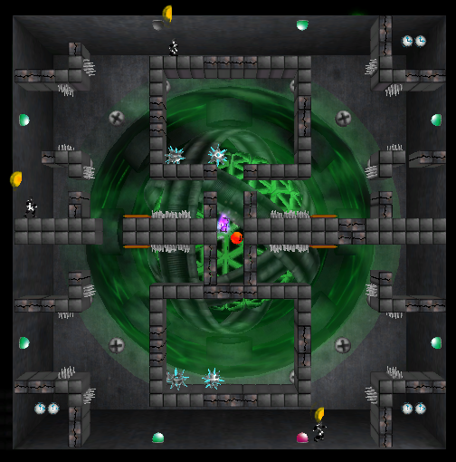
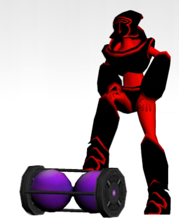
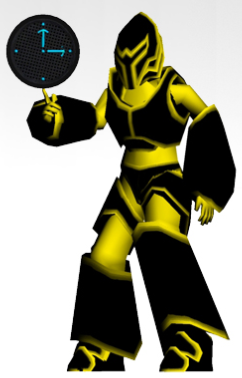
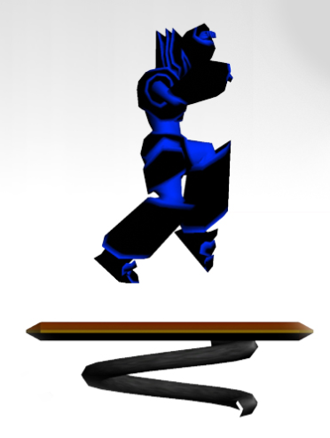
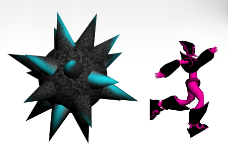
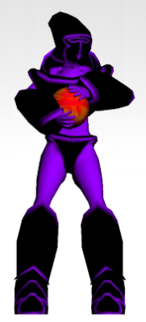
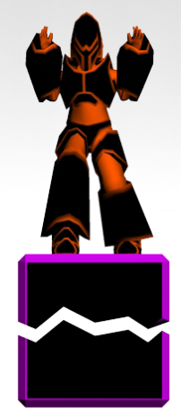
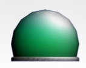

# Sajiki

A futuristic party game that defies gravity.

## Installation

- Install [PhysX System Software](https://www.nvidia.com/en-us/drivers/physx/physx-9-19-0218-driver/)
- Download the latest version from the [Releases page](https://github.com/dlip/sajiki/releases/tag/v1.1)
- Run setup
- If you get any other errors, try installing the following:
  - [DirectX End-User Runtimes](https://www.microsoft.com/en-us/download/details.aspx?id=8109)
  - [Visual C++ Redistributable](https://support.microsoft.com/en-us/help/2977003/the-latest-supported-visual-c-downloads)

## Instructions

- You have 120 seconds to live, be the last person alive to win.
- Win 6 rounds to become the champion!

- The Time Dialation Device pauses your personal countdown timer. Be the first to get it.

- Pickup clocks to give yourself extra time.

- Use jump pads to get to high places

- Spikey balls are not collectors items

- The slow motion pickup slows everyone else down but you - great for a quick get away

- Broken boxes fall away after a few seconds of standing on them - make sure you're not over the spikes!

- Stand on the switches to rotate the level 90 degress in a random direction and watch everyone fall

## Controls

### Joystick

- Move: Left/Right
- Jump: Up/Button 2
- Attack: Button 1

### Keyboard

- Player 1: UP DOWN LEFT RIGHT/Right Control
- Player 2: WASD/Left Control
- Player 3: IJKL/Space
- Player 4: NUMPAD 8456/Enter

## Credits

Made by the following AIE students in 2007

### Lead Design and Level Art

- Naomi Ross (naomi-ross@hotmail.com)

### Lead Programmer

- Dane Lipscombe (danelipscombe@gmail.com)

### Art and Animation

- Russell Coker (blacknight-63@hotmail.com)
- Tony Guest (emulsifier72@hotmail.com)
- Georgios Taraganis (gtaraganis@gmail.com)

### Music

- Simon Beard (ted_e_bare_69r@hotmail.com)
- Pat Winters

### Special Thanks

- Thanks to our teachers Lea Bartlettand Sebastian Perri from AIE Canberra 2007
